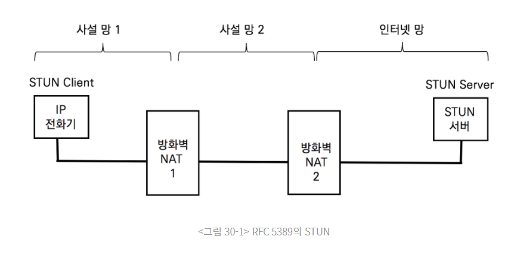

## ICE(Interactive Connectivity Establishment) ?

- STUN(Session Traversal Utilities for NAT)와 TURN(Traversal Using Relay for NAT)을 활용하는 프레임워크로
  SDP 제안 및 수락 모델(Offer/Answer Model)에 적용할 수 있다.
- 두 단말 간의 제안 및 수락 모델로 생성되는 실시간 UDP 미디어 스트림을 송수신하기 위해 NAT Traversal 기술이지만
  TCP 전송 프로토콜에도 적용 가능하다.
- ICE는 STUN 과 TURN 프레임워크로 확보된 통신 가능한 여러 IP 주소와 포트 넘버를 SDP Offer와 SDP Answer를 통해 상대방에게 전달한다.
- 두 단말은 확보된 모든 주소에 대해 단대단(Peer-to-peer) 연결성 테스트를 진행하고 통신 가능한 주소로 RTP 미디어 스트림을 송수신합니다.
  - NAT(Network Address Translator)
  - SDP(Session Description Protocol)
  - RTP(Real-Time Transport Protocol)

---

 
 

## STUN ?

- 클라이언트-서버 프로토콜 이다.
- STUN 클라이언트는 사설망에 위치하고, STUN 서버는 인터넷망에 위치한다.
- 클라이언트는 자신의 공인 IP주소를 사전에 확인하기 위해 서버에게 요청하고,
  서버는 클라이언트가 사용하는 공인 IP 주소를 응답한다.

### STUN 어떻게 동작?

- STUN 메시지가 방화벽을 지날 때 네트워크 계층의 IP와 전송 계층의 포트 넘버가 바뀐다.
- STUN 서버는 패킷의 IP/UDP 헤더값(클라이언트 공인 IP 주소 + 포트 넘버)와
  메시지 안에 있는 STUN 클라이언트의 IP/UDP 헤더값(클라이언트 사설 IP 주소 + 포트 넘버)를 비교하고,
  두 개의 서로 다른 주소에 대한 바인딩 테이블을 생성하고 요청에 대한 응답 메시지에 공인 IP 주소를 보낸다.
- STUN 클라이언트는 VoIP 시그널링을 생성할 때 사설 IP가 아닌 공인 IP 주소를 사용한다.
  

### STUN 용어

- STUN 클라이언트의 주소는 호스트 주소 또는 단말 주소라고 하고,
- STUN 서버가 알려주는 주소는 Reflexive Transport Address 또는 Mapped Address라고 한다.
- STUN 클라이언트는 SIP 메시지와 RTP 메시지에 Reflexive Transport Address를 사용한다.
  - SIP(Sesson Initiation Protoco)은 OSI 애플리케이션 계층에서 시그널링 처리 프로토콜이다.
  - RTP(Real-Time Transport Protocol)는 실시간 음성과 영상 및 데이터를 IP 네트워크로 전송하는 표준 프로토콜이다.
    - WebRTC, 전화, 텔레비전 서비스, 웹 기반의 푸시 투 토크 기능을 포함한 화상 통화 분야 등의 스트리밍 미디어를 수반하는 시스템에 사용 되고 있다.

### STUN 사용 못 하는 상황

- 두 단말이 같은 NAT 환경에 있을 경우 동작하지 않는다.
- 또한, Symmetric NAT로 동작하는 사설망 환경에서는 애플리케이션이 다르면 NAT 매핑 테이블이 바뀌기 때문에 사용할 수 없다.
- STUN 메시지로 확인한 STUN 클라이언트의 Reflexive Transport Address가 다른 애플리케이션인 SIP 시그널링과 RTP 프로토콜을 사용할 때는 주소가 바뀐다.

---

 
 

## TURN ?

- TURN 프로토콜은 NAT 환경에서 단말이 릴레이 서버를 이용하여 통신하게 한다.
- TURN 클라이언트는 사설망에, TURN 서버는 인터넷망에 위치한다.
- TURN 클라이언트는 통화를 할 피어들과 직접 통신하는 것이 아니라 릴레이 서버 역할을 하는 TURN 서버를 경유한다.
- TURN 클라이언트는 사설 주소가 포함된 TURN 메시지를 TURN 서버로 전송한다.
- TURN 서버는 TURN 메시지에 포함된 사설 주소와 TURN 메시지 패킷의 공인 주소인 layer3 IP 주소, layer4 UDP 포트 넘버 차이를 확인한다.
- TURN 서버는 TURN 클라이언트의 공인주소로 응답한다.
- NAT 장비는 NAT 매핑 테이블에 있는 정보에 따라 TURN 응답 메시지를 크라이언트의 사설 주소로 전송한다.
  

---

 
 

## STUN / TURN 초간단

- STUN은 단말이 자신의 공인 IP 주소와 포트를 확인하는 과정에 대한 프로토콜이고,
- TURN은 단말이 패킷을 릴레이 시켜줄 서버를 확인하는 과정에 대한 프로토콜이다.
- STUN 서버는 사설 주소와 공인 주소를 바인딩하고, TURN 서버는 릴레이 주소를 할당한다.
  특히 TURN은 ICE에서 직접 사용한다.

---

 
 

## ICE Candidate Gathering

- ICE를 실행하는 단말들은 통신이 가능한 모든 주소를 식별한다.
- 처음에 클라이언트는 STUN 메시지를 TURN 서버로 전송하고 수신하는 과정에서 릴레이 주소를 확인한다.
- 릴레이 주소는 TURN 서버가 패킷 릴레이를 위해 할당하는 주소이다.

## Candidate

- Candidate는 IP 주소와 포트 넘버의 조합으로 표시되는 주소를 의미.
- TURN 서버는 Relayed Candidate와 Server Reflexive Candidate(단말의 공인 IP 주소)를 응답하고,
  STUN 서버는 Server Reflexive Candidate를 응답한다.
  결국 사설망에 있는 단말은 3개의 통신 가능한 주소를 획득한다.

---

 
 

## NAT Traversal (NAT 투과기술) 이란?

- 사설 IP 주소를 가지는 두 단말(PC) 간에 통신(이를 P2P 통신이라고 부름)이 가능하도록 하는 기술이 NAT Traversal 임.
- NAT Traversal 기술은 크게 3가지.
  1. Hole Punching (직접 연결)
  2. Connection Reversal (역방향 연결)
  3. Relaying (중계 연결)

1. 직접 연결(Hole Punching) 방법은 단말간 통신을 하고자 하는 두 단말 모두 사설IP를 가지고 있는 경우
   외부에 있는 공인IP를 가진 연결서버(Matching Server)로 각각 접속하여 사설IP 정보와 공인 IP 정보를
   상호 제공 및 교환하고 이 과정을 통해 획득된 상대측 단말 정보를 이용 직접 접속을 통해 연결을 이루는 방법.
2. 역방향 연결(Connection Reversal) 방법은 P2P 통신을 하고자 하는 두 단말 중 하나는 공인 IP 주소를 가지는 경우에
   사설IP를 가진 단말이 공인IP를 가진 단말로 접속하는 연결방법 입니다.
3. 중계 연결(Relaying) 방법은 사설 IP 주소를 가지는 두 단말 간에 직접 통신을 할 수 없다면,
   공인 IP 주소를 가지는 외부의 중계 서버(Relay Server)를 통해 두 단말 간에 데이터를 주고받는 방식입니다.
